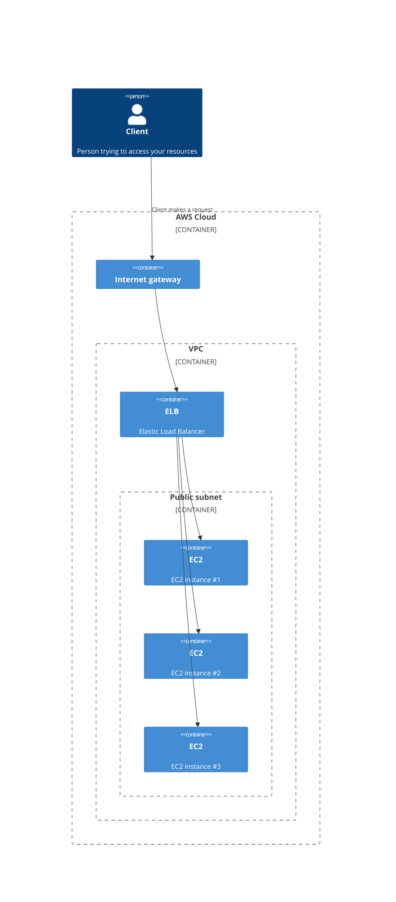
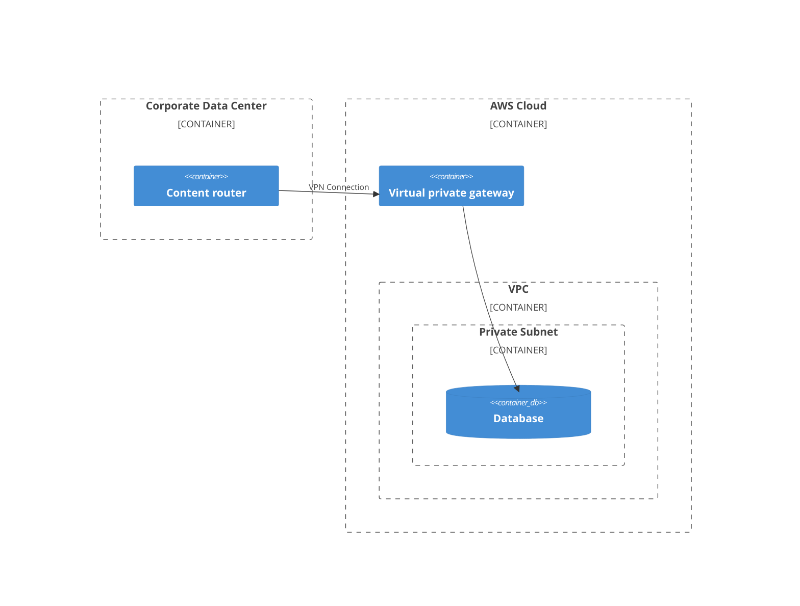
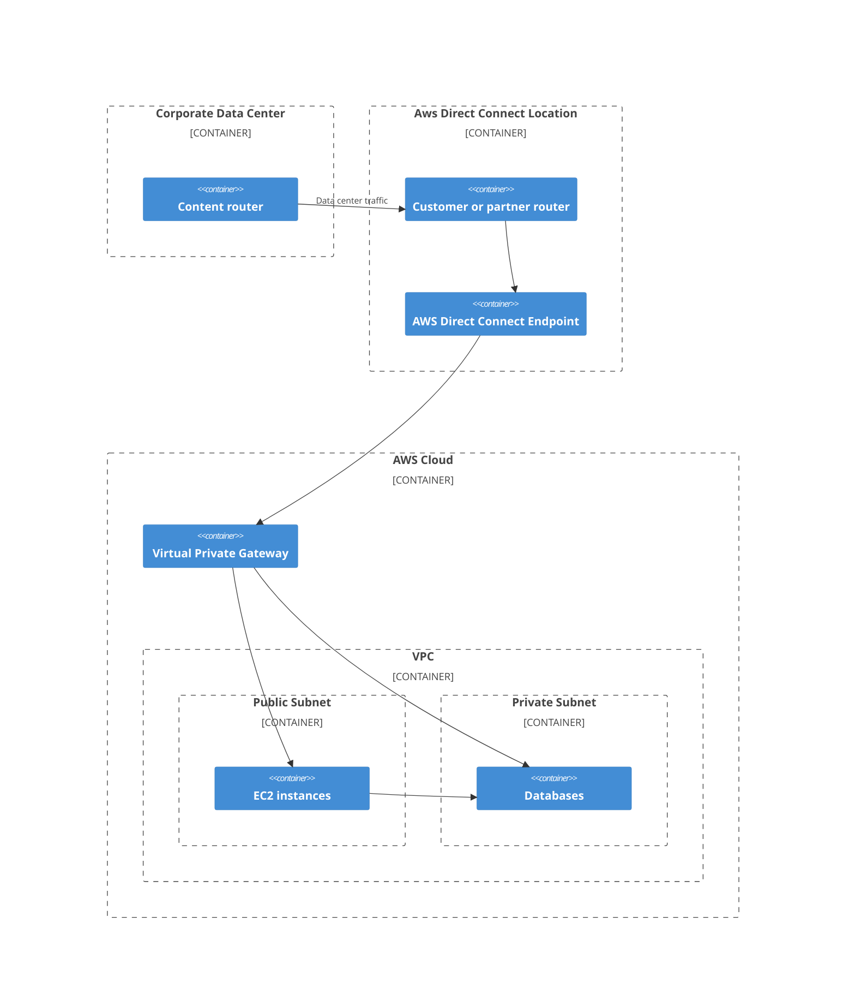

# Networking
We now have a couple of things running in the cloud, but all our services might be exposed. for some services that might not make sense. This is where `VPC`s come in. Amazon `Virtual Private Cloud`, or `VPC`, lets you provision an isolated section of the AWS Cloud where you can launch resources on a virtual network. Then you can choose yourself if your resources are public or private. We will have a look at the following concepts:
- Describe the [basic concepts of networking](#basic-concept-of-networking)
- Describe the [difference between public and private networking resources](#difference-between-public-and-private-networking-resources)
- Explain a virtual [private gateway](#virtual-private-gateway) using a real life scenario
- Describe the benefit of [AWS Direct Connect](#aws-direct-connect)
- Describe the [layers of security](#layers-of-security) used in an IT strategy
- Describe the services customers use to interact with AWS global network

## Basic concept of networking
A `VPC` allows you to define your private IP range for you AWS resources, and you place things like `EC2` instances ans `ELB`s inside of you `VPC`.
Now you don't just throw you services in there and be done. You want to create chunks of IP addresses and group your resources, these chunk are called `subnets`. Subnets, together with networking rules, control whether resources are private or public.  

### Difference between public and private networking resources
There are some scenarios where you want to control who can access your service. You might have a hr application or a database running and you only want it to be accessed by certain users on a `private network`. Or you have something like a company website, this should definitely be a `public-facing` service. User can access these these public or private networks with certain gateways. For public networks there is something called a `Internet Gateway` and for private networks there is `Virtual Private Gateway`.

#### Internet Gateway
To allow public traffic from the internet ti access your `VPC` you can attach a `Internet gateway`. With out this gateway, the internet cannot access your public resources, so it kind of the doorway to your `VPC`.

#### Virtual private gateway
To access resources in a `private network` we need to setup a `virtual private gateway`. 
A `virtual private gateway` enables you to establish a `virtual private network`, `VPN`, connection with your `VPC`. This gateway is configured to only allow connections from approved networks. 

The problem with this is that this connection, although encrypted, still uses very public routes to establish this connection. So to make it even more secure AWS has a service `AWS Direct Connect`.

#### AWS Direct Connect
`AWS Direct Connect` is a service that lets you create a private connection between your data center and a `VPC`. This private connection is routed through a `AWS Direct Connect Location` so it is truly a private connection, not an encrypted public connection.

This type of connection also helps you reduce network costs and increase the amount of bandwidth.

## Layers of security

